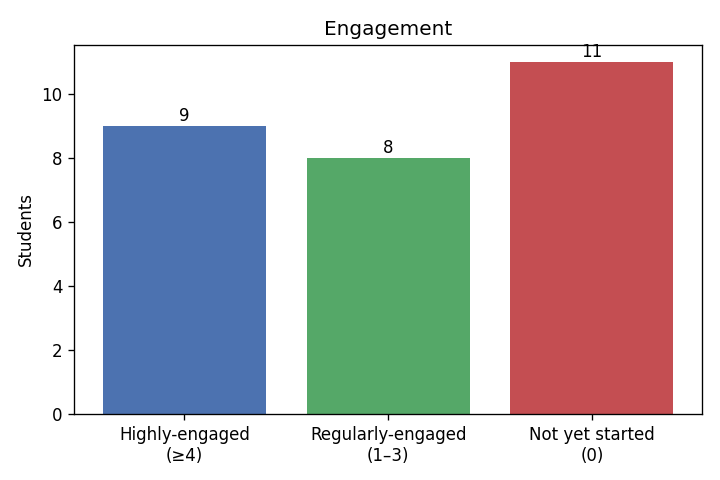
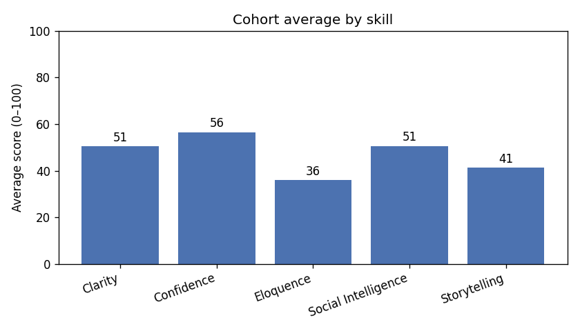
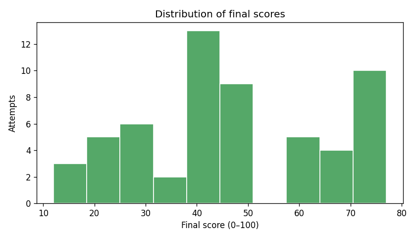
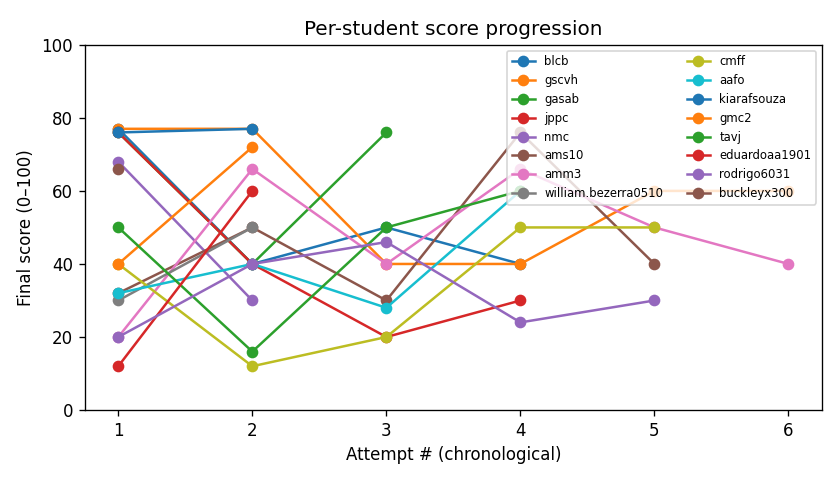

# Cesar School IEC Pilot — Minimock Practice Report

_Window: sessions on/after the 2026-05-28 workshop. Minimocks only._

## Overview

- **Students in cohort:** 28
- **Practiced (≥1 started session):** 17 (61%)
- **Practices started:** 62
- **Graded attempts:** 57 (92% of started)
- **In progress (started, not yet graded):** 5
- **Provisioned but never started:** 80 sessions
- **Avg practices / student:** 2.21 (per practicing student: 3.65)

**Engagement** — counts practices _started_ (graded or not):

- **Highly-engaged (≥4):** 9
- **Regularly-engaged (1–3):** 8
- **Not yet started (0):** 11

> Scores & feedback below are computed over the **57 graded attempts** only.

## Scores

- **Average final score:** 47.0 / 100
- **Median final score:** 40.0 / 100

**Average by skill:**

| Skill | Avg (0–100) |
| --- | --- |
| Clarity | 50.5 |
| Confidence | 56.5 |
| Eloquence | 36.0 |
| Social Intelligence | 50.6 |
| Storytelling | 41.3 |

**By minimock type:**

| Type | Attempts | Avg score |
| --- | --- | --- |
| behavioral_interview | 43 | 45.8 |
| cultural_fit | 11 | 47.8 |
| technical_case | 2 | 58.0 |
| difficult_conversations | 1 | 68.0 |

## Progress (linear trend over attempts)

- **Improving:** 10  ·  **Declining:** 5  ·  **Flat:** 0
- **Insufficient data (<2 scored):** 1
- **Mean slope (pts / attempt):** 3.96

| Student | Scored | First | Last | Slope | Trend |
| --- | --- | --- | --- | --- | --- |
| eduardoaa1901 | 2 | 12 | 60 | 48.00 | improving |
| gmc2 | 2 | 40 | 72 | 32.00 | improving |
| william.bezerra0510 | 2 | 30 | 50 | 20.00 | improving |
| aafo | 4 | 32 | 60 | 7.20 | improving |
| tavj | 4 | 50 | 60 | 6.40 | improving |
| cmff | 5 | 40 | 50 | 5.80 | improving |
| ams10 | 5 | 32 | 40 | 4.20 | improving |
| amm3 | 6 | 20 | 40 | 2.23 | improving |
| kiarafsouza | 2 | 76 | 77 | 1.00 | improving |
| rodrigo6031 | 5 | 20 | 30 | 0.40 | improving |
| gasab | 3 | 76 | 76 | -0.00 | declining |
| gscvh | 6 | 77 | 60 | -3.89 | declining |
| blcb | 4 | 77 | 40 | -10.10 | declining |
| jppc | 4 | 76 | 30 | -15.80 | declining |
| nmc | 2 | 68 | 30 | -38.00 | declining |
| buckleyx300 | 1 | 66 | 66 | n/a | insufficient data |

## Feedback themes

**Top areas to improve** (by skill, mentions):

- Eloquence: 60
- Clarity: 52
- Storytelling: 43
- Social Intelligence: 38
- Confidence: 33

_Examples — Eloquence:_

> **Use vocabulário mais sofisticado** — Você usou frases simples e diretas, mas poderia ter utilizado um vocabulário mais amplo e sofisticado para expressar suas ideias.

> **Develop your vocabulary** — Use more varied and precise language to convey your ideas and thoughts.

> **Desenvolva sua linguagem** — Você usou expressões como 'opa' e 'nunca trabalhei em grupo'. Tente usar uma linguagem mais formal.

**Top strengths** (by skill, mentions):

- Storytelling: 36
- Clarity: 23
- Social Intelligence: 22
- Confidence: 17
- Eloquence: 1

_Examples — Storytelling:_

> **Great use of the STAR method** — You provided a specific example of explaining a technical concept to a colleague and described the outcome.

> **Você contou histórias interessantes e específicas** — Você usou o método STAR para compartilhar exemplos concretos e específicos, tornando as suas respostas mais atraentes e convincentes.

> **Good use of the STAR method** — You were about to tell a story using the Situation, Task, Action, Result (STAR) method, but didn't complete it.

---

_Generated by `report.py`. Charts in `charts/`._